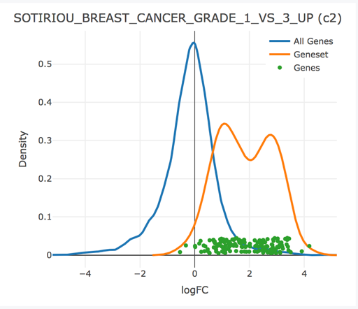

<!-- README.md is generated from README.Rmd. Please edit that file -->

# multiGSEA

[](https://travis-ci.org/lianos/multiGSEA)

<!--
[](https://codecov.io/github/lianos/multiGSEA?branch=master)
-->

The `multiGSEA` package was built to facilitate the use of gene sets in
the analysis of high throughput genomics data (primarily RNA-seq).
Analysts can orchestrate any number of GSEA methods across a specific
contrast using the unified interface provided by the `multiGSEA`
function, and a shiny application is provided that facilitates the
exploration and interpretation of GSEA results.

  - The `multiGSEA` function is a wrapper that orchestrates the
    execution of any number of user-specified gene set enrichment
    analyses (GSEA) over a particular experimental contrast of interest.
    This will create a `MultiGSEAResult` object which stores the results
    of each GSEA method internally, allowing for easy query and
    retrieval.
  - A sister
    [`multiGSEA.shiny`](https://github.com/lianos/multiGSEA.shiny)
    package provides an `explore` function, which is invoked on
    `MultiGSEAREsult` objects returned from a call to `multiGSEA`. The
    shiny application facilitates interactive exploration of these GSEA
    results. This application can also be deployed to a shiny server and
    can be initialized by uploading a serialized `MultiGSEAResult`
    `*.rds` file.

Full details that outline the use of this software package is provided
in the [package’s
vignette](https://lianos.github.io/multiGSEA/articles/multiGSEA.html),
however a brief description is outlined below.

# Usage

A subset of the RNA-seq data tumor/normal samples in the BRCA indication
from the TCGA are provided in this package. We will use that data to
perform a “camera” and “fry” gene set enrichment analysis of tumor vs
normal samples using the MSigDB hallmark and c2 gene set collections
with `multiGSEA`.

``` r
library(multiGSEA)
library(dplyr)
gdb <- getMSigGeneSetDb(c('H', 'C2'), species = 'human', id.type = "entrez")
vm <- exampleExpressionSet(dataset = 'tumor-vs-normal', do.voom = TRUE)
mg <- multiGSEA(gdb, vm, vm$design, "tumor", methods=c("camera", "fry"))
```

We can view the top “camera” results with the smallest pvalues like so:

``` r
results(mg, "camera") %>% 
  arrange(pval) %>% 
  select(collection, name, padj) %>% 
  head
#>   collection                                        name         padj
#> 1         C2      SOTIRIOU_BREAST_CANCER_GRADE_1_VS_3_UP 1.037263e-36
#> 2         C2 ROSTY_CERVICAL_CANCER_PROLIFERATION_CLUSTER 1.037263e-36
#> 3         C2         NAKAYAMA_SOFT_TISSUE_TUMORS_PCA2_DN 1.718472e-23
#> 4         C2              KANG_DOXORUBICIN_RESISTANCE_UP 1.203816e-22
#> 5         C2               CROONQUIST_IL6_DEPRIVATION_DN 2.486087e-22
#> 6         C2                     BENPORATH_PROLIFERATION 7.471399e-22
```

The shift in expression of the genes within the top gene set can be
visualized with the `iplot` function below. This plot produces
interactive graphics, but rasterized versions are saved for use with
this `README` file:

``` r
iplot(mg, 'c2', 'SOTIRIOU_BREAST_CANCER_GRADE_1_VS_3_UP', type = "density")
```



``` r
iplot(mg, 'c2', 'SOTIRIOU_BREAST_CANCER_GRADE_1_VS_3_UP', type = "boxplot")
```


When these plots are rendered in your workspace or an Rmarkdown
document, the user can hover of the genes (dots) to see their name and
differential expression statistics.

For an immersive, interactive way to explore the GSEA results, use the
`multiGSEA.shiny::explore(mg)` method\!

# Installation

The multiGSEA suite of packages will soon be submitted to bioconductor
and installable via the recommended `BiocManager::install()` mechanism.
In the meantime, install this package *<multiGSEA.shiny@develop>* branch
from github, which sould install both multiGSEA.shiny and multiGSEA
packages.

``` r
# install.packages("BiocManager")
BiocManager::install("lianos/multiGSEA.shiny@develop")
```
